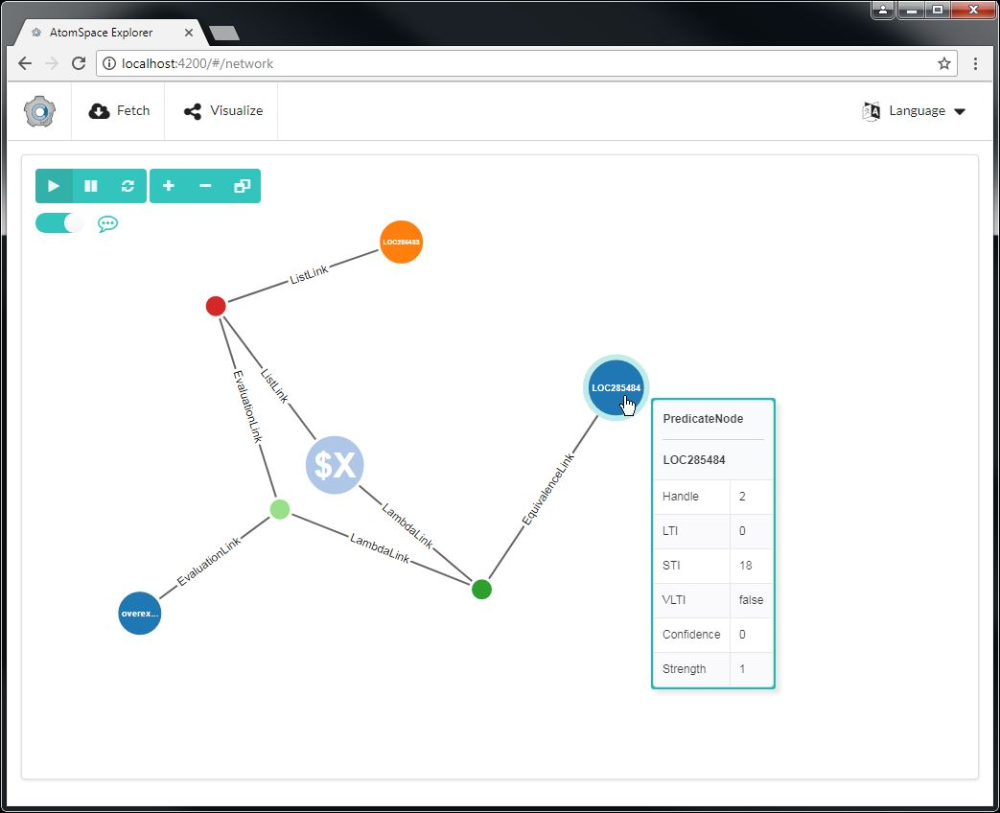

# AtomSpace Explorer

The AtomSpace Explorer is a visualization tool for OpenCog data. Atoms are fetched from the CogServer via the AtomSpace REST API, then displayed as a two dimensional graph in the browser.



## Features

- Fetch data from user provided AtomSpace REST api URL.
- Visualize the AtomSpace data with D3.js Force Directed graph.
- Links display link-type as inline labels.
- Node names are shown within Nodes with auto-sizing text. Also, the Node name is auto-truncated with ellipsis if necessary.
- Node diameter is weighted per Attention Value - Short Term Interest (STI).
- Click on a Node to view it's properties. Use close icon ('X') to dismiss properties. Or reclick same Node again to dismiss the properties box.
- Double click on a Node to drill to that Node, along with two levels of neighboring Nodes.
- Buttons to Pause / Play / Restart Force Simulation and  to Zoom In, Zoom Out, and Reset Zoom.
- Keyboard shortcuts for all of the above buttons are indicated in the corresponding button tooltips.
- A Filtering dropdown appears when a Node is selected or double-clicked.
- D3 client area and Node context (right-click) menus.
- Individual Nodes are pinnable into fixed location. Ctrl-click, Ctrl-double-click, Ctrl-drag, or use right-click menu to Pin/Unpin a Node. Right-click the D3 client area to access a menu command to Unpin all Nodes.
- Increased Force Simulation Charge can be applied to individual Nodes. Shift-click, Shift-double-click, Shift-drag, or use right-click menu to apply/remove high charge force to/from a Node. Right-click the client area to access a menu command to remove high charge from all Nodes. With suitable data, like single Nodes with many children subtrees, this is nice for spreading (repulsing) out neighboring nodes more forcefully in a radial fashion from that central, highly-charged Node.
- D3 Graph client area and SVG canvas is dynamically-sized relative to the browser window size, including auto-resize of Force Simulation. Scrollbars are avoided within limits of minimum width, height, and width-to-height ratios.
- Tooltips for all Navbar and Visualizer command buttons.
- Tooltips for Nodes and Links. Node and Link tooltip verbosity is controlled via the 'Detailed Tooltips' toggle checkbox. In verbose mode, the Node detail level is the same as the selected Node properties table. Both methods can be used together, which provides a convenient way to compare details between a baseline selected Node, and other Nodes via hovering over them. The 'Detailed Tooltips' toggle checkbox also affects Link tooltip verbosity in a similar manner. Tips:
  - The Force Simulation can optionally be paused to make it easier to hover over Nodes and Links to show details via tooltips. However, tooltips do also work while the simulation is running.
  - For Link tooltips, hover over the text label of a Link, as that's easier than hovering over the link line itself, which is quite thin.
- Localized to English, Chinese, French, German, Italian, Japanese and Spanish via the Languages dropdown menu item.

The AtomSpace Explorer app was based upon the Mozi Visualizer Demo app (which was in turn based on the Glimpse visualizer).

As the initial commit of the AtomSpace Explorer has substantial changes, there's a more detailed list of the changes and new additions below under the Oct-10-2017 "Initial Commit" section of the Revision History.

## Requirements

1. node v6.0.0 or above

This project was originally generated with [angular-cli](https://github.com/angular/angular-cli) version 1.0.0-beta.28.3.

## Setup

``` bash
sh                                  # Inside the root directory of this file
npm install                         # Install all dependencies.
npm start                           # Start the app on the default AngularJS port 4200.

npm start -- --port=[port-number]   # Start the app at [port-number].
npm start -- --port=8080            # Example with port number 8080.

Alternatively, you can permanently change the default port by inserting the following to angular-cli.json, at the top of the "defaults" block:
  "defaults": {                     #    Existing line.
    "serve": {                      # <- Insert line.
      "port": 8080                  # <- Insert line. Example port 8080. Set port number as desired.
    },                              # <- Insert line.
    "styleExt": "css",              #    Existing line.

```

## Usage

1. Navigate to [http://localhost:4200/](http://localhost:4200/)
1. Click on Fetch in the Navbar. A 'Fetch AtomSpace Results' prompt is displayed. Then do any of the following options:
   - Fetch from CogServer:  Enter a valid CogServer URL __*__ in the Server URL box.
    I.E <http://localhost:5000> or <http://my_cogserver:5000> __*__, then click on the Fetch button to graph the data.
   - Load built-in sample data:  Click on 'Load Sample Data'. See next section regarding configuring sample data.
   - Load non-default built-in sample data: Enter the path, in the form of 'assets/{file-name}' to any of the bundled sample data json files in the Server URL box. I.E. 'assets/atoms.humans.json' (enter it without quotes). Then click on the Fetch button.

    __\* Note: Do <u>not</u> append '/api/v1.1/atoms', as was required for earlier versions of AtomSpace Explorer.__

## Sample Data

- Sample data files reside in ./src/assets/
- Configure which sample data file is utilized via config setting 'sample\_data\_file' in ./src/app/app.config.ts. Then recompile (ng serve).
- Provided sample files
  - atoms.sample1.json: Original built-in sample.
  - atoms.sample1a.json: Same as previous, with some non-zero STI values.
  - atoms.sample1b.json: Same as previous, plus two additional three-node-clusters.
  - atoms.sample2.json: Original external sample.
  - atoms.sample2a.json: Subset of original external sample. Has several double-linked nodes.
  - atoms.sample2b.json: Subset of original external sample. Has several double-linked nodes. Plus a triple-linked node.
  - atoms.humans.json: From humans.scm.
  - atoms.oovc\_ensemble.json: From oovc_ensemble.scm.
  - atoms.oovc\_ensemble\_sti.json: Same as previous, with non-zero STI values. <== *Configured as default sample*

## Dependencies

- As of Jan-13-2018, the D3 Atomspace charting code from this app has been moved into the reusable NPMJS [ng2-atomspace-visualizer](https://www.npmjs.com/package/ng2-atomspace-visualizer) package. From now on, enhancement requests and issues that are specifically related to D3 Atomspace charting functionality should be logged against ng2-atomspace-visualizer, not this app.
- For now, "@angular/cli" in the "devDependencies" must remain at version 1.4.7. Later versions have stricter Typescript compliance enforcement, and ng2-atomspace-visualizer is not currently compatible.

## Known Issues

- Filtering capability is preliminary and needs to be developed further.
- D3 graphs are generated by building all of the individual elements in the DOM. Consequently, there are limits to the number of nodes and links that are performant. Remediations are TBD.
  - Recommendations: Use smaller datasets for visualization. FF can get slow when it has lots of plug-ins running and/or a lot of memory allocated. If it's behaving poorly, try closing all browser instances and reopening a new one. I've had good luck with Chrome, so you may want to try using Chrome.

## Revision History

### Feb-25-2018 - sshermz - Localization improved

- Localization now fully implemented for all container (this host app) Navbar buttons & dropdowns, including their tooltips. Depends on ng2-atomspace-visualizer  version 1.3.5, which adds language support, and honors the container's language selection.

### Jan-21-2018 - sshermz - Updated to latest ng2-as-visualizer, Simplified fetch URL, RT fetch of unordered linktypes & miscellaneous

- Updated to [ng2-atomspace-visualizer](https://www.npmjs.com/package/ng2-atomspace-visualizer) 1.3.2.
- Simplified required URL for fetching from CogServer AtomSpace REST api. Now enter an address like <http://localhost:5000> or <http://255.255.255.255:5000>. Do <u>not</u> append '/api/v1.1/atoms' like before. Fetch dialog help text updated too.
- Fixed Fetch spinning load icon which wasn't appearing.
- Updated default (built-in) list of unordered linktypes. Also added dynamic call to fetch unordered linktypes from Cog Server whenever fetching data. If successful, overrides built-in list. Depends on new (cog-get-all-subtypes 'UnorderedLink) scheme command (github.com/opencog/atomspace/pull/1516).
- License update.

### Jan-13-2018 - sshermz - Migrated to NPMJS ng2-atomspace-visualizer package and miscellaneous

- Migrated to the NPMJS [ng2-atomspace-visualizer](https://www.npmjs.com/package/ng2-atomspace-visualizer) package which now provides the D3 Atomspace Visualizer charting functionality. Conseqently, the local D3 Atomspace charting code has been deleted from this AtomSpaceExplorer app. Future Atomspace D3 charting-specific enhancements and fixes will be applied to ng2-atomspace-visualizer, and can then be utlilized in this app by simply updating to the latest version of ng2-atomspace-visualizer.
- Various changes to support above change to ng2-atomspace-visualizer. Including downgrade of angular-cli version. See the newly added Dependencies section above for details.
- Bug Fix: Fixed Production mode compile errors. Now can successfully execute 'ng serve --prod'.
- Some Typescript compliance fixes.

### Jan-3-2018 - sshermz - Bug fix and multiple link handling improvement

- Bug Fix: Double-click on nodes to drill didn't work in the region covered by the selected node properties table, even when the table was hidden. Bonus with this fix is that you can now drag nodes even if they are behind the visible selected node properties table.
- Feature Change: Max number of multiple links supported increased from 3 maximum to 7 maximum. Beyond 7 will need to be handled in a different manner in the future.

### Jan-2-2018 - sshermz - Link enhancements: Directional arrowheads and support for multiple links between nodes. Also bug fixes

- New Feature: Added arrowheads to link lines. Ordered (asymmetric) link types now have a single arrowhead to show "incoming set" direction. And unordered (symmetric) link types now have arrowheads on both ends. For now, unordered link types are identified by new config parameter 'unordered\_linktype\_roots' in app.config.ts. Fixes #108.
- New Feature: Added incoming and outgoing handle lists to selected node properties box, and also to detailed-mode tooltips.
- Bug Fix: Now handling multiple links between a pair of nodes. Double links are drawn with opposing arc paths (which required changing links from svg:line to svg:path). Up to 3 links between a pair of nodes is currently supported. Fixes #111.
- Bug Fix: Fixed bug with extraction of link types from atomspace data, which is used for dynamically constructed filter menu. Was not retrieving all link types.
- Refactoring: Minor cleanup of unused code and other minor improvements.

### Dec-28-2017 - sshermz - Bug fixes and minor refactoring

- Bug Fix: Minor dependency update. Fixes #115.
- Bug Fix: Zooming fix to keep zoom scale in sync when zoom by wheel.
- Refactoring: Minor refactoring of D3 graphing code.
- Build: Removed unnecessarily checked in ./semantic/ files.

### Nov-30-2017 - sshermz - Zooming / Panning enhancements, Simulation reheating and boundary removal, and dynamic Filter menu

- New Feature: Removed boundaries from Force Simulation (controlled via const isContrained). Nodes now may drift out of the view boundaries during the Force Simulation, even with the default zoom level. However, you can pan and/or zoom out, to get access to any Nodes that have drifted out of view.
- New Feature: Added an extra level of zoom out from the default level. In other words, from the default zoom level, you can zoom out one further step (or zoom in the same as before).
- New Feature: Restart no longer resets zooming to default level. So now if you zoom in or out, then Restart, the Force Simulation will replay at your current zoom level.
- New Feature: If you click on Play, without first clicking on Pause, additional "heat" will be added to the Force Simulation.
- New Feature: Right-click 'Recenter Panning' and 'Pan (Node) to center' commands. The latter menu option appears when you right-click on a Node, else you get the former menu option if you right-click anywhere else.
- New Feature: Enabled zooming by mouse wheel. This type of zooming is relative to the position of your mouse cursor.
- New Feature: Filter types in the 'Filter On Selection' dropdown menu are now generated dynamically by parsing them from the data. These were previously hard-coded and therefore did not match the actual Nodes and Links in the AtomSpace data.

### Nov-27-2017 - sshermz - Simulation Force update and bug fixes

- Feature Change: Revised Simulation Force to avoid squashing of Atoms/Links to the D3 client area boundaries (includes removal of gravity force from previous commit which only helped in certain cases). Fixes #105.
- Samples: Added another sample json file, atoms.oovc\_ensemble\_sti.json, and changed to it as the default built-in sample.
- Bug Fix: Suppress tooltips after Fetch until mouse is moved one time. Avoids unintended tooltips when Fetch data and Nodes or Links happen to slide under mouse cursor.
- Bug Fix: Fixed stroke width bug in Node decorator drawing code.
- Bug Fix: Fixed context menu regression.
- Refactoring: More refactoring of the D3 graphing code.

### Nov-24-2017 - sshermz - Tooltips for Links, auto-positioning tooltips, Simulation Force tweaks, package updates, etc

- New Feature: Added explicit 'Load Sample Data' button on Fetch dialog. Added a couple of new sample files. Refactored and documented sample data files, and how to configure. See 'Sample Data' section above.
- New Feature: Added tooltips for Links. Like with the existing Nodes tooltips, Link tooltips support both standard and detailed modes (per the toggle checkbox for tooltip verbosity). Tip: Hover over the text of a Link, which is easier than hovering over the link line, as it's quite thin.
- New Feature: Autopositioning tooltips. Now tooltips automatically shift from bottom to top, and from right to left positions automatically to avoid being truncated by the edge of the browser window.
- New Feature: Added Gravity to Simulation Force. Helps distribution of atoms within D3 graph client area, at least for small data sets. Related to #105.
- Bug Fix: Surface underlying Fetch error message instead of always reporting "Can't Connect to Server" when there's a problem.
- Updated many packages to latest versions, including to Angular v5.
- Refactoring: Some further refactoring of D3 graphing code. Also Fetch from AtomSpace error handling. Including to add a timeout for http get.

### Oct-27-2017 - sshermz - Fetch URL History enhancement and a few fixes

- New Feature: Fetch URL History. Most recent AtomSpace Fetch URL is prepopulated in the Fetch URL field. Implemented by storing in browser local storage. Can be cleared with the Fetch popup's 'Reset' button, or by clearing your browser cache. Fixes #103.
- Bug Fix: Capped max fetch atom count to 2500, though the practical limit is probably below that. D3 graphs are DOM heavy and it's currently not feasible to load up a greater number of atoms than that. Fixes #101.
- Bug Fix: Changed short-cut for stealth version number popup from 'v' key to Ctrl-Alt-v. Fixes #104.
- Bug Fix: Stop (hidden) simulation when click on Fetch button.

### Oct-21-2017 - sshermz - Apply High Charge to Node feature, filtering improvements, performance fix and refactoring

- New Feature: Apply very high force simulation charge to a specific Node, thereby strongly repulsing all of it's neighbors. With suitable data, like single Nodes with many children subtrees, this is nice for spreading (repulsing) out neighboring nodes more forcefully in a radial fashion from that central, highly-charged Node. Available on Node right-click menu. Can also apply with Shift key when selecting, clicking, double-clicking or dragging Nodes.
- Feature Change: Added more filter types in Filtering dropdown. Longer-term, need to generate dynamically and/or provide type in filter so user can enter any filter type.
- Feature Change: Changed STI weighted Node size scale up factor from 33% to 50%, to make it a bit more noticeable.
- Performance: Double-click filtering previously hid Nodes and Links > 2 levels away from double-clicked Node. Those hidden Nodes/Links remained in the DOM, affecting performance and also the Force Simuation behavior. Now when you double-click, the non-neighboring Nodes and Links are pruned from the DOM, providing a much nicer and performant user experience with the double-click-filtered data.
- Bug Fix: Filtering dropdown now supports returning to default Unfiltered state. Workaround that cleared the Node selection and closed the filter dropdown was removed.
- Bug Fix: Replaced Enter key shortcut to restart with Shift-Pause, as Enter key also invokes a button when the focus is on that button.
- Refactoring: Refactoring of D3 graphing code.

### Oct-17-2017 - sshermz - Package updates (Angular 4, etc), plus minor feature & bug fixes

- Updated Angular 2 to Angular 4, and other packages to latest where ever possible. Fixes as necessary due to deprecations, including to MaterialModule. Also some TSLint fixes. Fixes #97.
- New Feature: Keep in paused mode if drag Node while paused (Simulation will tick while dragging, but will now repause when the drag is completed).
- Bug Fix: Revised some shortcut keys. Space bar interferes with the tabbing/space bar method of operating the UI, so now using Pause key to Pause / Unpause the Force Simulation, instead of the Space bar.
- Bug fix: Added Esc key handling for cancelling context menus (for real this time!).
- Documentation: How to override default port number added to README.md.

### Oct-15-2017 - sshermz - HTML Tooltips, plus a few minor features and bug fixes

- New Feature: Intelligent HTML formatted tooltips, with normal and verbose modes. Verbose mode is selected via new Tooltips toggle checkbox, which has been added underneath the other D3 graph command buttons. The toggle checkbox is styled to match the Semantic UI teal theme. In Verbose mode, the same level of detail, that's in the right-side Node properties box, is shown. However the tooltips are more convenient for quickly surveying details amongst many Nodes without requiring any clicks. Can also use to compare other Nodes to the selected Node. Default non-verbose tooltips are improved to the same new style, and show both the name if available, like before, but now also always show the type. In other words, now all Nodes show tooltips, dynamically showing what information is available.
- New Feature: Node properties dialog now also shows Node Name, if there is one.
- Improvement: Right-justified the Node properties 'X' close icon, as is standard for a close button. Also added circular border to make it's purpose more clear. Also did minor node properties table fixes, cleanups & style refinements.
- New Feature: Added Esc key handling for cancelling context menus. As a bonus, also added new shortcut keys within the new key handling function for various graph command buttons: Space bar pauses and resumes D3 Force Simulation. Enter restarts D3 Force Simulation. Numpad +/- for Zooming. Numpad * for resetting zoom level. And the graph command button tooltips have been updated to indicate all of these shortcuts to help make them self-evident.
- Bug Fix: Fixed main context menu which wasn't always available when D3 rect was offset by panning.
- Bug Fix: Fixed a couple of navbar tooltip positions.
- Also added some disabled node centering and pan recentering code, but disabled for now as it doesn't work when zoomed in.
- Minor refactoring.

### Oct-10-2017 - sshermz - Initial Commit

#### *Changes from the Mozi Visualizer Demo app*

- Changed adjacent link labels to inline, which required adding matching SVG shadow text elements to overwrite link line beneath labels.
- Node name auto-sizing and auto-truncating with ellipsis.
- Node emphasis for nodes with STI (larger radius).
- Added Node properties dismissal via reclick on same Node.
- Added ability to pause, resume and restart the Force Simulation with new buttons for each.
- Added reset zoom button.
- Rebranded app to AtomSpace Explorer, including change of main icon to OpenCog icon, and change of default Angular icon in browser tab to small Cog icon.
- Changed Navbar "Network" to "Visualize", and changed the Semantic-UI icons for Fetch and Visualize. Added hyperlink to <http://opencog.org/> from Navbar OpenCog icon.
- Fixed Navbar buttons alignment to fully left-justified Icon/Fetch/Visualize, and fully right-justified Language dropdown.
- Partial fixes to Filter dropdown - Changed redundant "Show All" vs ("Show All Data") to "Clear Filter" (with an added divider). However, "Clear Filter" is still doing "Show All Data" like before. TODO to fix this to only remove current filter, and not show all data when filtered to a node and 2 levels of neighbors via a double-click. BTW, perhaps there should be more than the 3 hard-coded filter types?
- Added meaningful tooltips to all Navbar elements, and to all Graph buttons.
- Added context (right-click) menus for D3 client rect, and for Nodes.
- Added Pin/Unpin feature which is accessible via CTRL actions and via the context menus. Also an Unpin all for the D3 client rect area.
- Added dynamic resizing for ui-grid and below elements.
- Added tooltips to all buttons.
- Changed Node properties dialog border to match the teal of the Semantic UI graph buttons.
- Added new translations to French, German, Italian, Japanese and Spanish, as previously only English and Chinese was implemented.
- Refactoring of hard-coded values in D3 graphing code to consts.
- Fixed TSLint for project.
- TSLint fixes to D3 graphing code.
- Added detailed code comments to D3 graphing code. Plus renaming of various D3/Visualizer related classes, vars and functions for readability.
- Added D3/Visualizer classnames and/or ids to some classes to aid debugging.
- Added new built-in samples (selection is currently changed at compile time).
- Miscellaneous refactoring and bug fixes of D3 graphing code.
